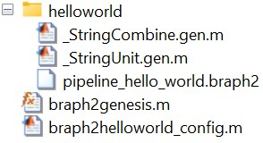
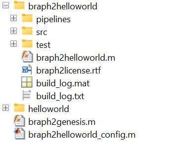
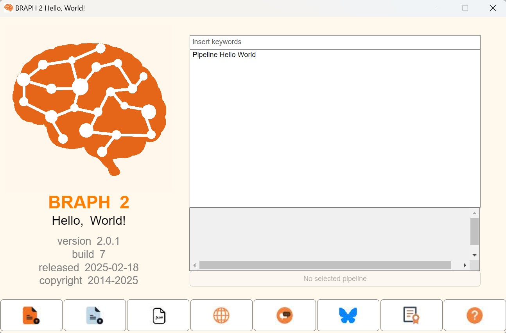
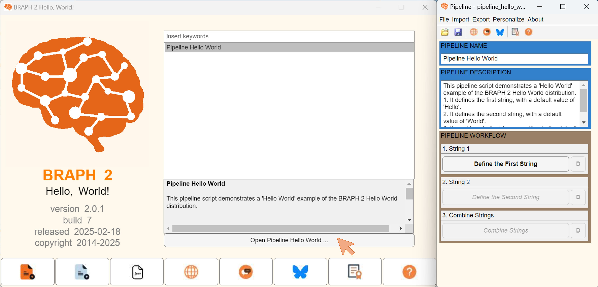
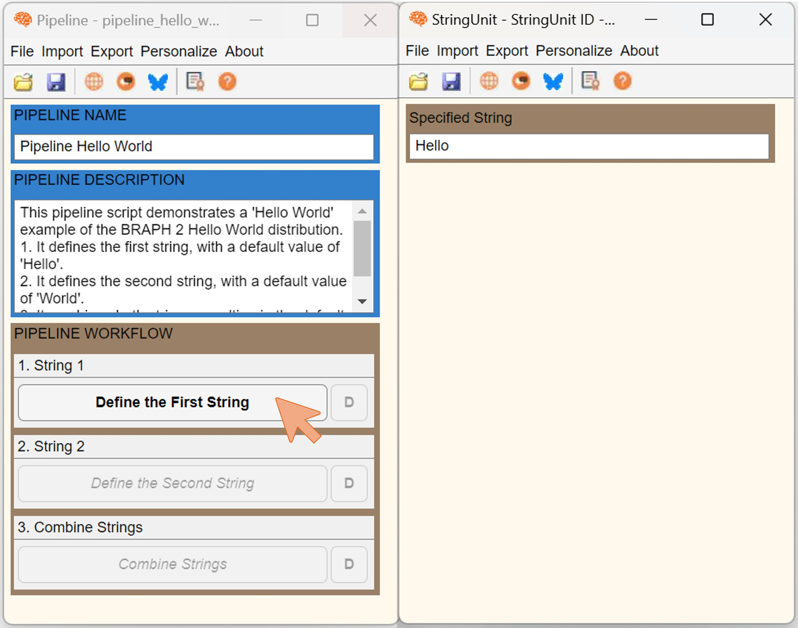

# Create a New BRAPH~2 Distribution: Hello, World!

[](dev_distribution.pdf)

The software architecture of BRAPH 2 provides a clear structure for developers to understand and extend its functionalities. 
Developers can easily create new distributions with their own pipelines. 
By recompiling BRAPH 2, the new pipelines and their functionalities are integrated into a new distribution with its own graphical user interface.
In this developer tutorial, you will learn how to create a new distribution of BRAPH 2 that contains a simple pipeline where the user enters a first string (e.g., “Hello”) and a second string (e.g., “World”), and the pipeline combines them into a single string (“Hello World”).


## Table of Contents
> [Create a New Distribution Folder](#Create-a-New-Distribution-Folder)
>
> [Create New Elements](#Create-New-Elements)
>
>> [_StringUnit.gen.m](#StringUnitgenm)
>>
>> [_StringCombine.gen.m](#StringCombinegenm)
>>
> [Create New Pipeline](#Create-New-Pipeline)
>
> [Create Configuration File](#Create-Configuration-File)
>
> [Compile New Distribution](#Compile-New-Distribution)
>
> [Run Example "Hello, World!"](#Run-Example-"Hello-World")
>
> [Existing BRAPH 2 Distributions](#Existing-BRAPH-2-Distributions)
>


<a id="Create-a-New-Distribution-Folder"></a>
## Create a New Distribution Folder  [⬆](#Table-of-Contents)

First, we need to create a new folder that will contain all the new scripts referring to this new distribution. For the example explained in this tutorial the name of this new folder will be "helloworld". Furthermore, the genesis compiler from the Standard BRAPH 2 Distribution needs to be downloaded. This compiler is a Matlab file [braph2genesis.m](https://github.com/braph-software/BRAPH-2/tree/develop/braph2genesis/braph2genesis.m))  located in the Standard BRAPH 2 Github Repository. This file needs to be placed outside the newly created folder "helloworld" as shown in Figure 1.




> **Figure 1. Folder tree**
> All files needed to create the new "Hello, World!" BRAPH 2 Distribution.

<a id="Create-New-Elements"></a>
## Create New Elements  [⬆](#Table-of-Contents)

BRAPH 2 is a compiled object-oriented programming software. Its
objects are elements, which contain a set of properties of various categories and formats, as described in detail in the tutorial [General Developer Tutorial for BRAPH 2](https://github.com/braph-software/BRAPH-2/tree/develop/tutorials/developers/dev_intro). All objects are derived from a base object called `Element` and written in a simplified pseudocode (files "*.gen.m") that is compiled into the actual elements (files "*.m") by the command `braph2genesis`.
Even though it is possible to create instances of `Element`, it does not have any props and typically one uses its subclasses. Its three direct subclasses are `NoValue`, `Callback`, and `ConcreteElement`. The details of each subclass can be found in tutorial [General Developer Tutorial for BRAPH 2](https://github.com/braph-software/BRAPH-2/tree/develop/tutorials/developers/dev_intro). 

In this tutorial, we will use the subclass  `ConcreteElement` that provides the infrastructure necessary for all concrete elements, like strings.
Thus, following these rules the following two new objects need to be created and placed inside the previously created folder "helloworld" as shown in Figure 1.:

	- {`\bf _StringUnit.gen.m`}: contains a user-defined string. 
	- {`\bf _StringCombine.gen.m`}: combines the strings from two string units.


The new generator files will have the same structure:  `¡header!` , `¡layout!`, `¡props` (properties), ` ¡props_update!` (update the properties of the `ConcreteElement`) and `¡tests!` (to add unit tests). While the `¡header!` the token `¡build!` are required,
the rest is optional.


<a id="StringUnitgenm"></a>
### _StringUnit.gen.m  [⬆](#Table-of-Contents)


> **Code 1.** **StringUnit element header.**
> 		The `header` section of the generator code in "_StringUnit.gen.m" provides the general information about the `StringUnit` element.
> ````matlab
> %% ¡header!
>     StringUnit < ConcreteElement (s, string) contains a user-defined string.  ①
> 
>     %%% ¡description!
>     A String Unit (StringUnit) contains a user-defined string. 
>     This element is created for distribution demonstration purpose.
> 
>     %%% ¡seealso!
>     StringCombine, PanelPropString
>     
>     %%% ¡build!
>     1
> ````
> 
> ① defines `StringUnit` as a subclass of `ConcreteElement`. The moniker will be `s`.
> 


> **Code 2.** **StringUnit layout.**
> 		The `layout` section of the generator code in "_StringUnit.gen.m" provides the information about the layout that we want to crete for the `StringUnit` element.
> ````matlab
> %% ¡layout!  ①
>     
>     %%% ¡prop!
>     %%%% ¡id!
>     StringUnit.S
>     %%%% ¡title!
>     Specified String
> ````
> 
> ① creates a new layout in the graphical user interface allowing the user to introduce a string.
> 


> **Code 3.** **StringUnit element props update.**
> 		The `props_update` section of the generator code in "_StringUnit.gen.m" updates the properties of the `ConcreteElement` element.
> ````matlab
> %% ¡props_update!
>     
>     %%% ¡prop!
>     ELCLASS (constant, string) is the class of the string unit.
>     %%%% ¡default!
>     'StringUnit'
>     
>     %%% ¡prop!
>     NAME (constant, string) is the name of the string unit.
>     %%%% ¡default!
>     'String Unit'
>     
>     %%% ¡prop!
>     DESCRIPTION (constant, string) is the description of the string unit.
>     %%%% ¡default!
>     'A String Unit (StringUnit) contains a user-defined string. This element is created for distribution demonstration purpose.'
>     
>     %%% ¡prop!
>     TEMPLATE (parameter, item) is the template of the string unit.
>     %%%% ¡settings!
>     'StringUnit'
>     
>     %%% ¡prop!
>     ID (data, string) is a few-letter code for the string unit.
>     %%%% ¡default!
>     'StringUnit ID'
>     
>     %%% ¡prop!
>     LABEL (metadata, string) is an extended label of the string unit.
>     %%%% ¡default!
>     'StringUnit label'
>     
>     %%% ¡prop!
>     NOTES (metadata, string) are some specific notes about the string unit.
>     %%%% ¡default!
>     'StringUnit notes'
> ````
> 


> **Code 4.** **StringUnit element props.**
> 		The `props` section of generator code in "_StringUnit.gen.m" defines the properties to be used in "StringUnit".
> ````matlab
> %% ¡props!
>     
>     %%% ¡prop! 
>     S (data, string) is the user-defined string.
>     %%%% ¡default!
>     'Hello'
> ````
> 


> **Code 5.** **StringUnit element tests.**
> 		The `tests` section of generator code in "_StringUnit.gen.m"
> ````matlab
> %% ¡tests!
>     
>     %%% ¡test!
>     %%%% ¡name!
>     test
>     %%%% ¡code!
>     defined_string = 'test';
>     su = StringUnit('S', defined_string);
>     
>     assert(isequal(su.get('S'), defined_string), ...
>     [BRAPH2.STR ':StringUnit:' BRAPH2.FAIL_TEST], ...
>     'StringUnit does not store the defined string properly.' ...
>     )
> ````
> 


<a id="StringCombinegenm"></a>
### _StringCombine.gen.m  [⬆](#Table-of-Contents)

The `_StringCombine.gen.m` generator file is created the same way as `_StringUnit.gen.m`.


> **Code 6.** **StringCombine element header.**
> 		The `header` section of the generator code in "_StringCombine.gen.m" provides the general information about the `StringCombine` element.
> ````matlab
> %% ¡header!
>     StringCombine < ConcreteElement (sc, string combine) combines the string from two string units.  ①
>     
>     %%% ¡description!
>     A String Combine (StringCombine) combines the strings from two string units.
>     This element is created for distribution demonstration purpose.
>     
>     %%% ¡seealso!
>     StringUnit, PanelPropString
>     
>     %%% ¡build!
>     1
> ````
> 
> ① defines `StringCombine` as a subclass of `ConcreteElement`. The moniker will be `sc`.
> 


> **Code 7.** **StringCombine layout.**
> 		The `layout` section of the generator code in "_StringCombine.gen.m" provides the information about the layout that we want to crete for the `StringCombine` element.
> ````matlab
> %% ¡layout!
>     
>     %%% ¡prop!
>     %%%% ¡id!
>     StringCombine.SU1
>     %%%% ¡title!
>     The First String
>     
>     %%% ¡prop!
>     %%%% ¡id!
>     StringCombine.SU2
>     %%%% ¡title!
>     The Second String
>     
>     %%% ¡prop!
>     %%%% ¡id!
>     StringCombine.S_COMBINED
>     %%%% ¡title!
>     Combined Strings
> ````
> 


> **Code 8.** **StringCombine element props update.**
> 		The `props_update` section of the generator code in "_StringCombinet.gen.m" updates the properties of the `ConcreteElement` element.
> ````matlab
> %% ¡props_update!
>     
>     %%% ¡prop!
>     ELCLASS (constant, string) is the class of the string combine.
>     %%%% ¡default!
>     'StringCombine'
>     
>     %%% ¡prop!
>     NAME (constant, string) is the name of the string combine.
>     %%%% ¡default!
>     'String Combine'
>     
>     %%% ¡prop!
>     DESCRIPTION (constant, string) is the description of the string combine.
>     %%%% ¡default!
>     'A String Combine (StringCombine) combines the strings from two string units. This element is created for distribution demonstration purpose.'
>     
>     %%% ¡prop!
>     TEMPLATE (parameter, item) is the template of the string combine.
>     %%%% ¡settings!
>     'StringCombine'
>     
>     %%% ¡prop!
>     ID (data, string) is a few-letter code for the string combine.
>     %%%% ¡default!
>     'StringCombine ID'
>     
>     %%% ¡prop!
>     LABEL (metadata, string) is an extended label of the string combine.
>     %%%% ¡default!
>     'StringCombine label'
>     
>     %%% ¡prop!
>     NOTES (metadata, string) are some specific notes about the string combine.
>     %%%% ¡default!
>     'StringCombine notes'
> ````
> 


> **Code 9.** **StringCombine element props.**
> 		The `props` section of generator code in "_StringCombine.gen.m" defines the properties to be used in "StringCombine".
> ````matlab
> %% ¡props!
>     
>     %%% ¡prop!
>     SU1 (data, item) is the first string unit.
>     %%%% ¡settings!
>     'StringUnit'
>     
>     %%% ¡prop!
>     SU2 (data, item) is the second string unit.
>     %%%% ¡settings!
>     'StringUnit'
>     
>     %%% ¡prop!
>     S_COMBINED (result, string) is the combined strings.
>     %%%% ¡calculate!
>     value = [sc.get('SU1').get('S') ' ' sc.get('SU2').get('S')];  ①
> ````
> 
> ① combines the strings which are specified with `SU1` and `SU2` from a `StringUnit` element.
> 


> **Code 10.** **StringCombine element tests.**
> 		The `tests` section of generator code in "_StringCombine.gen.m"
> ````matlab
> %% ¡tests!
>     
>     %%% ¡test!
>     %%%% ¡name!
>     test
>     %%%% ¡code!
>     defined_string1 = 'test1';
>     su1 = StringUnit('S', defined_string1);
>     
>     defined_string2 = 'test2';
>     su2 = StringUnit('S', defined_string2);
>     
>     sc = StringCombine('SU1', su1, 'SU2', su2);
>     
>     assert(isequal(sc.get('S_COMBINED'), [defined_string1 ' ' defined_string2]), ...
>     [BRAPH2.STR ':StringCombine:' BRAPH2.FAIL_TEST], ...
>     'StringCombine does not combine the defined strings properly.' ...
>     )  ①
> ````
> 
> ① we verify that the new element `StringCombine` succesfully combines the strings which are specified with `sU1` and `sU2`.
> 


<a id="Create-New-Pipeline"></a>
## Create New Pipeline  [⬆](#Table-of-Contents)

Once the new elements are created, a pipeline that takes the created elements and runs the desired functionality is needed. In this case the pipeline will let the user choose two strings (e.g., "Hello") and (e.g., "World"), and combine them (e.g., "Hello, World!").


> **Code 11.** **Pipeline *Hello, World!***
> 		We need to create a new file (e.g., "pipeline_hello_world.braph2") that includes the following code to create a new pipeline for the "Hello, World!" example.
> ````matlab
> %% Pipeline Hello World
> 
>     % This pipeline script demonstrates a 'Hello World' example of the BRAPH 2 Hello World distribution.
>     % 1. It defines the first string, with a default value of 'Hello'.
>     % 2. It defines the second string, with a default value of 'World'.
>     % 3. It combines both strings, resulting in the default output 'Hello World'.
>     
>     % PDF: 
>     % README: 
>     
>     %% String 1  ①
>     su1 = StringUnit('S', 'Hello'); % Define the First String % First String
>     
>     %% String 2  ②
>     su2 = StringUnit('S', 'World'); % Define the Second String % Second String
>     
>     %% Combine Strings
>     sc = StringCombine('SU1', su1, 'SU2', su2); % Combine Strings % First String + Second String
> ````
> 


<a id="Create-Configuration-File"></a>
## Create Configuration File  [⬆](#Table-of-Contents)

A configuration file is needed to build a new distribution.


> **Code 12.** **Configuration file**
> 		We need to create a new file (e.g., "braph2helloworld_config.m") with all the configuration details.
> ````matlab
> distribution_name = 'Hello, World!';  ①
>     distribution_moniker = 'helloworld';  ②
>     pipeline_folders = {
>         'helloworld' ...
>     }; ③
>     braph2_version = 'heads/ywc-lite-genesis';  ④
>     
>     % Add here all included and excluded folders and elements
>     % '-folder'                 the folder and its elements will be excluded
>     %
>     % '+folder'                 the folder is included, but not its elements
>     %   '+_ElementName.gen.m'   the element is included,
>     %                           if the folder is included
>     %
>     % '+folder*'                the folder and its elements are included
>     %   '-_ElementName.gen.m'   the element is excluded,
>     %                           if the folder and its elements are included
>     % (by default, the folders are included as '+folder*')
>     rollcall = { ...
>         '+util', '+_Exporter.gen.m', '+_Importer.gen.m', ...
>         '+ds*', '-ds_examples', ...
>         '-analysis', ...
>         '-atlas', ...
>         '-gt', ...
>         '-cohort', ...
>         '-nn', ...
>         '+gui', '+_ExporterPipelineBRAPH2.gen.m', '+_GUI.gen.m', '+_GUIElement.gen.m', ...
>         '+_GUIFig.gen.m', '+_GUILayout.gen.m', '+_ImporterPipelineBRAPH2.gen.m', ...
>         '+_Panel.gen.m', '+_PanelElement.gen.m', '+_PanelFig.gen.m', '+_PanelProp.gen.m', ...
>         '+_PanelPropItem.gen.m', '+_PanelPropString.gen.m', '+_Pipeline.gen.m', '+_PipelineCode.gen.m', ...
>         '+_PipelinePP_Notes.gen.m', '+_PipelinePP_PSDict.gen.m', '+_PipelineSection.gen.m', ...
>         '+_PanelPropStringTextArea.gen.m', ...
>         '-brainsurfs', ...
>         '-atlases', ...
>         '-graphs', ...
>         '-measures', ...
>         '-neuralnetworks', ...
>         '+pipelines', ...
>         '+helloworld*', '+hellouniverse*', ...
>         '+test*', ...
>         '-sandbox' ...
>     };  ⑤
>     
>     files_to_delete = { ...
>         ['src' filesep 'gui' filesep 'test_GUIFig.m'], ...
>         ['src' filesep 'gui' filesep 'test_PanelFig.m'], ...
>     }; ⑥
> ````
> 
> ① specifies the name of the new distribution. This name will appear in the main window of the new distribution GUI.
> 
> ② short identifier used in launcher functions and filenames. It should only contain letters, numbers, and underscores.
> 
> ③ defines the folders that contain the newly created pipelines we want to include in our new distribution. This is a cell array of strings.
> 
> ④defines the version of BRAPH 2 (e.g., 'tags/2.0.1' or 'heads/develop') to fetch from Github to create the new distribution. The build number should be 7 or larger (version 2.0.1 or subsequent).
> 
> ⑤ defines which folders an elements from the Standard BRAPH 2 distribution we want to maintain in our new distribution. With this definition we avoid compiling elements that are not necessary and and that involve long compilation times.
> 
> ⑥ specifies files to be removed after compilation.
> 


<a id="Compile-New-Distribution"></a>
## Compile New Distribution  [⬆](#Table-of-Contents)

To compile the software, you simply just need to run Code 13.


> **Code 13.** **Execute BRAPH 2 compiler.**
> 		To compile the newly created (or new version) distribution software you need to call the BRAPH 2 genesis compiler specifying the configuration file with the details of the new distribution.
> ````matlab
> braph2genesis('braph2helloworld_config.m')
> ````
> 

If the compilation ended successfully, the following log message should appear:

`***All good!***`

A new "braph2helloworld" folder would have been generated which can then be used as explained in Section~\ref{sec:example}.

%%% YU-WEI: Add file structure of the compiled version

WARNING: To ensure a successful compilation, the folder "braph2helloworld" (if already created) should be erased and all of its dependencies should be removed from the MATLAB path. This folder will be regenerated after a successful compilation.


<a id="Run-Example-"Hello-World""></a>
## Run Example "Hello, World!"  [⬆](#Table-of-Contents)
\label{sec:example}

To run the software, you simply just need to run Code 13 and a new GUI will appear as shown in Figure 2.


> **Code 14.** **Execute BRAPH 2 compiler.**
> 		To run the newly created (or new version) distribution software you need to call the newly created launcher file.
> ````matlab
> braph2helloworld
> ````
> 




> **Figure 2. New BRAPH 2 "Hello, World!" distribution.**
> This is the newly created GUI for the BRAPH 2 "Hello, World!" distribution.




> **Figure 3. Running "Hello, World!" Example.**
> Steps to run the example case:
> 	**a** Click on "Define the First String" from the pipeline GUI. A new GUI window will open **a**. Here you can introduce whatever string ("Hello" by default).
> 	**2** Click on "Second String" from the pipeline GUI. A new GUI window will open **b**. Here you can introduce whatever string ("World" by default).
> 	**c** Click on "Combine Strings" to obtain the combination of the two previously defined strings A new GUI window will open **b**. Here you need to press  "C" to obtained the combined strings.


<a id="Existing-BRAPH-2-Distributions"></a>
## Existing BRAPH 2 Distributions  [⬆](#Table-of-Contents)

There is an already created [BRAPH 2 Memory Capacity Distribution](https://github.com/braph-software/MemoryCapacity)), see Figure 4, that implemented a pipeline to perform a *reservoir computing* analysis using *connectivity data*. Check the tutorial [Pipeline for Analysis and Comparison of Memory Capacity using Weighted Undirected Graph
](https://github.com/braph-software/MemoryCapacity/tree/develop/tutorials/tut_mc_wu) that shows how to calculate the global and regional memory capacity (Figure 5) for each subject and compare between groups of subjects. This pipeline has been used to derive the results in the manuscript: “Computational memory capacity predicts aging and cognitive decline” by Mijalkov et al. (2025).




> **Figure 4. Memory Capacity Distribution**
> Interface of the BRAPH 2 Memory Capacity Distribution.




> **Figure 5. Nodal Memory Capacity**
> **a** Calculated Nodal Memory capacity in a group of subjects.
> 	**c** The value of the difference between two groups, the p-values (1-tailed and 2-tailed), as well as the confidence intervals. 
> 	**c** Comparison results, with positive values in red and negative values in blue on the brain surface.
